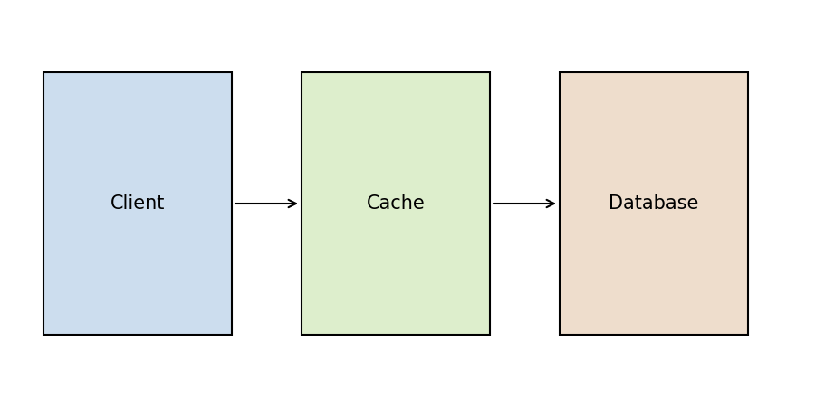
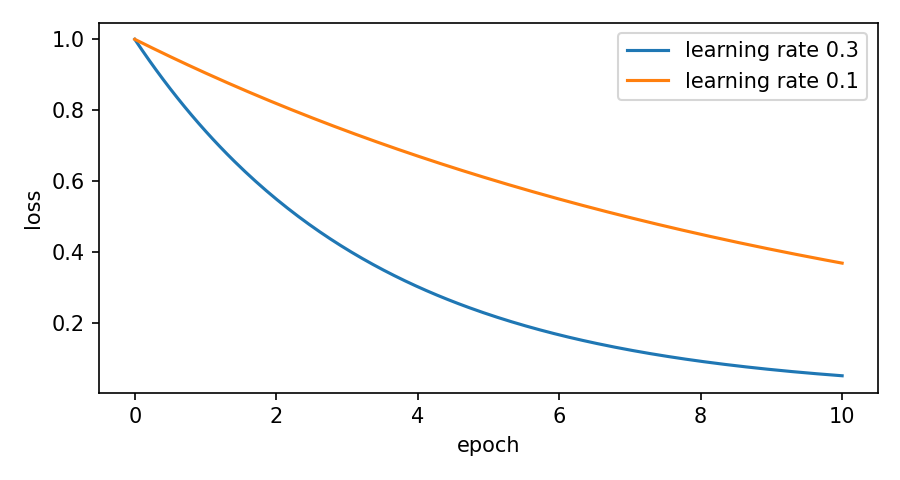

# Caching in Practice {#ch-cache}

A cache is a small, fast store that sits between a program and a slow source of data. When the program needs a
value, it asks the cache first; only if the value is missing does it go to the database, the network or the disk.
This chapter shows a simple cache in Java, explains when it helps, and lists the mistakes that make it slower than
no cache at all.[^first]

[^first]: The word *cache* comes from the French verb *cacher*, "to hide". The cache hides the latency of the source.

{#fig-cache width=80%}

Figure 1 shows the usual arrangement. The client never talks to the database directly: the cache forwards a
request only on a miss and keeps the answer for the next caller.

## A Minimal Implementation

The class below wraps a `HashMap` and a loader function. The method `get()` returns the stored value when the key
is present and calls `loader.apply(key)` otherwise. Note that `computeIfAbsent` performs the check and the insertion
in one step, so two threads cannot both miss and both load the same key.

```java
import java.util.Map;
import java.util.concurrent.ConcurrentHashMap;
import java.util.function.Function;

public final class ReadThroughCache<K, V> {
    private final Map<K, V> store = new ConcurrentHashMap<>();
    private final Function<K, V> loader;

    public ReadThroughCache(Function<K, V> loader) {
        this.loader = loader;          // called only on a miss
    }

    public V get(K key) {
        return store.computeIfAbsent(key, loader);
    }

    public void invalidate(K key) {
        store.remove(key);
    }
}
```

To try it, create the cache with a slow loader and call `get()` twice with the same key. The second call returns
immediately, because the value is already in `store`:

```java
var cache = new ReadThroughCache<String, Integer>(name -> {
    sleep(1_000);                      // pretend to query a database
    return name.length();
});
cache.get("volatile");                 // takes one second
cache.get("volatile");                 // returns at once
```

> **Note:** The keyword `volatile` in Java has nothing to do with caches of this kind. It controls how threads see
> writes to a field. Do not confuse the processor cache with an application cache.

## When a Cache Helps

A cache pays off only when three conditions hold at the same time:

1. Reads are much more frequent than writes.
2. The same keys are requested again and again. For example:
    - user profiles on a social network;
    - exchange rates that change once a minute;
    - compiled templates in a web server.
3. A slightly stale answer is acceptable, or the cache is invalidated on every write.

If even one of these conditions fails, the cache adds memory pressure and code complexity without any gain in speed.

## Measuring the Hit Ratio

The *hit ratio* $h$ is the share of requests served from the cache. With a hit time $t_c$ and a miss time $t_s$, the
average access time is

$$ \bar{t} = h \, t_c + (1 - h)\, t_s . $$

For $t_c = 1$ ms, $t_s = 50$ ms and $h = 0.9$ we get $\bar{t} = 0.9 + 5 = 5.9$ ms, which is more than eight times
faster than going to the source every time. Table 1 shows how quickly the benefit disappears as the hit ratio falls.

: Average access time for $t_c = 1$ ms and $t_s = 50$ ms

| Hit ratio | Average time, ms | Speed-up |
|----------:|-----------------:|---------:|
| 0.99      | 1.49             | 33.6     |
| 0.90      | 5.90             | 8.5      |
| 0.50      | 25.50            | 2.0      |
| 0.10      | 45.10            | 1.1      |

The last row is worth remembering: with a hit ratio of 10% the cache almost never helps, yet it still consumes
memory and still has to be kept consistent.

# Gradient Descent {#ch-gd}

Many machine learning models are trained by gradient descent. The idea is simple: start from a random point and
repeatedly take a small step in the direction in which the loss decreases fastest.[^name]

[^name]: The method was described by Augustin-Louis Cauchy in 1847, long before the first computer was built.

## The Update Rule

Let $\boldsymbol{\theta}$ be the vector of model parameters and $J(\boldsymbol{\theta})$ the cost function. One step
of batch gradient descent is

$$ \boldsymbol{\theta}^{(k+1)} = \boldsymbol{\theta}^{(k)} - \eta \, \nabla_{\boldsymbol{\theta}} J\big(\boldsymbol{\theta}^{(k)}\big), $$

where $\eta$ is the learning rate. For linear regression with the mean squared error the gradient has a closed form:

$$ \nabla_{\boldsymbol{\theta}} J(\boldsymbol{\theta}) = \frac{2}{m} \mathbf{X}^\top \left( \mathbf{X} \boldsymbol{\theta} - \mathbf{y} \right). $$

Here $m$ is the number of training instances, $\mathbf{X}$ is the $m \times n$ feature matrix and $\mathbf{y}$ is the
vector of targets. The normal equation $\hat{\boldsymbol{\theta}} = (\mathbf{X}^\top \mathbf{X})^{-1} \mathbf{X}^\top \mathbf{y}$
gives the same answer in one step, but it becomes slow when the number of features $n$ is large: inverting an
$n \times n$ matrix costs about $O(n^{2.4})$ to $O(n^3)$ operations.

## Choosing the Learning Rate

{#fig-loss width=80%}

Figure 2 compares two learning rates. With $\eta = 0.3$ the loss falls quickly; with $\eta = 0.1$ it falls three
times more slowly. A learning rate that is too large makes the algorithm jump across the valley and diverge.

The following code runs batch gradient descent with NumPy. The variable `eta` is the learning rate, and `n_epochs`
is the number of passes over the training set:

```python
import numpy as np

rng = np.random.default_rng(seed=42)
m = 100
X = 2 * rng.random((m, 1))
y = 4 + 3 * X + rng.standard_normal((m, 1))
X_b = np.c_[np.ones((m, 1)), X]        # add x0 = 1 to each instance

eta, n_epochs = 0.1, 1_000
theta = rng.standard_normal((2, 1))
for epoch in range(n_epochs):
    gradients = 2 / m * X_b.T @ (X_b @ theta - y)
    theta -= eta * gradients

print(theta.ravel())                   # close to [4, 3]
```

After a thousand epochs `theta` is close to the true values $\theta_0 = 4$ and $\theta_1 = 3$. The small difference
comes from the noise added to `y`.

## Common Mistakes

- **Unscaled features.** If one feature ranges from 0 to 1 and another from 0 to 1,000, the cost function looks like
  a long, narrow bowl, and gradient descent needs many more steps. Use `StandardScaler` before training.
- **A fixed learning rate for stochastic gradient descent.** Without a *learning schedule* the parameters keep
  bouncing around the minimum instead of settling in it.
- **Too few epochs.** Plot the loss (as in Figure 2) and stop only when the curve has flattened.

# Working with the Command Line {#ch-cli}

Most tools in this book are started from a terminal. This short chapter explains the few commands you need and the
conventions used in the examples.

## Conventions

Commands that you type are shown after a `$` prompt; lines without a prompt are the output of the command:

```console
$ docker compose run --rm translate book.epub programming
Glossary: base, programming (117 terms)
Translating 152 paragraphs...
Done in 4 min 12 s
```

Environment variables are written in capitals, for example `MODEL` or `PAGES`. A value in angle brackets, such as
`<book>`, is a placeholder that you replace with your own value.

## Useful Commands

Git
: A version control system. `git status` shows what has changed, `git diff` shows how.

Docker
: Runs programs in containers. `docker ps` lists the running containers; `docker logs <name>` prints their output.

Ollama
: Serves language models over HTTP. `ollama list` shows the downloaded models, and `ollama ps` shows which of them
  are loaded and how much of each sits in video memory.

## Exercises

1. What is the difference between `git diff` and `git diff --staged`?
2. Why does `ollama ps` sometimes show a model split between the CPU and the GPU?
3. Write a command that prints the last 20 lines of the log of the container `ollama`.

Solutions to these exercises are in the appendix of the full edition. Water boils at 100 °C at sea level, and the
chemical formula of water is H~2~O; these two facts have nothing to do with the command line but are useful for
checking that subscripts survive translation, just as 2^10^ = 1,024 checks superscripts.
